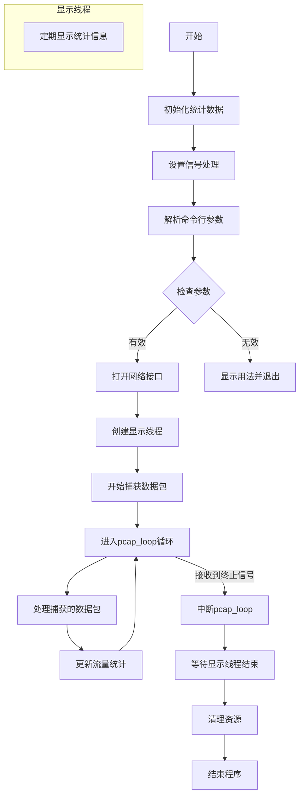
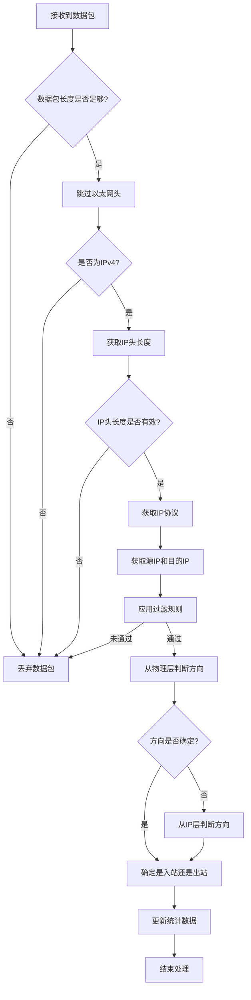

# Openwrt流量监控网页
## 目标
运用 C 语言进行编程开发，实现流量监控功能。需要获取的数据包括但不限于： 1.源 IP 地址/目的 IP 地址 2.累计接收(发送)流量 3.流量峰值 4.过去某个时间段的平均流量，例：过去 2s、过去 10s、过去 40s
开发前端可视化界面与后端服务器接口。通过发送 HTTP 请求获取流量监控的实时数据信息，并将其直观呈现于前端界面，以实现数据的实时监测与可视化展示。
项目已在Github上开源[HanphoneJan/OpenWrtTrafficMonitor: 基于Openwrt虚拟机的流量监控界面开发](https://github.com/HanphoneJan/OpenWrtTrafficMonitor)
## 开发环境要求
ubuntu22.04，linux gcc 环境，C 语言库 Libpcap。ubuntu 虚拟机的创建请自行搜索教程。
openwrt 虚拟机或者搭载了 openwrt 的路由器
## 一、Openwrt 环境配置
[官方教程参考：OpenWrt 维基\]VMware 上的 OpenWrt ](https://openwrt.org/docs/guide-user/virtualization/vmware)
### 下载镜像并转换格式
[参考资料：VMware Workstation 部署最新版 OpenWrt 23.05.3-CSDN 博客](https://blog.csdn.net/gtj0617/article/details/137706312)
[安装包下载/releases/24.10.0/targets/x86/64/](https://downloads.openwrt.org/releases/24.10.0/targets/x86/64/) [starwindconverter 下载](https://www.starwindsoftware.com/tmplink/starwindconverter.exe)

将系统镜像转为适用于 vmware workstation 的 vmdk 文件

选择磁盘模式，可选项为 growable（自增长）和 pre-allocated（预分配），**如果目标位置选择本地，则只能转换为 pre-allocated（预分配）模式**，如果选择了远端设备，则可以转换为 growable（自增长）或 pre-allocated（预分配）。

### 使用 vmdk 文件创建虚拟机

##### 选择硬件兼容性

**硬件兼容选择 WorkStation17.5x，24.10 版本对应 linux6.6 内核。SCSI 磁盘类型更现代，新版本 openwrt 支持**

VMware Workstation 是直接在 windows 系统下安装软件，安装后再在软件里面安装虚拟机，而 ESXi 相当于一个 linux 操作系统，直接像安装 linux 系统一样安装后，再在另一台 windows 电脑上通过 web 或者安装 vcenter 连接访问 esxi，然后再安装和管理虚拟机。
##### **选择使用现有虚拟磁盘**

含义： 将新虚拟机直接关联到一个已经存在的虚拟磁盘文件（如 **.vmdk 文件**） 新虚拟机“继承”该磁盘上的所有现有数据（操作系统、应用、文件、配置等）。非拷贝操作： 只是建立链接关系，不会复制磁盘文件本身。新虚拟机直接读写这个已存在的磁盘文件。新虚拟机的启动和运行状态完全取决于该磁盘内安装的操作系统和软件的状态。

### openwrt 虚拟机

##### 设置密码

```bash
passwd root  #设置密码
```

##### 配置 ip，映射到本机

选择虚拟机的网卡为 NAT 模式，并确保虚拟机和宿主机处在同一网段之下。本机打开命令行，输入 ipconfig，查看 VMnet8 的 IPv4 地址 ipaddr。我的是 192.168.70.1。在 openwrt 虚拟机中输入 vi /etc/config/network，修改 lan 口的 ipaddr 为’192.168.70.101‘（192.168.70.xxx 都行，根据前面的 ipaddr 修改），即 option ipaddr ’192.168.70.101‘。重启网络服务。

##### 使用 luci(WebUI)

[参考资料：OpenWrt Wiki\] LuCI 要点](https://openwrt.org/zh-cn/doc/howto/luci.essentials)

openwrt 已经自带 luci，可以直接打开（可能比较简陋，需要升级以及汉化）

```bash
opkg install luci
opkg install luci-app-cli
opkg list luci-i18n-\* //查看可用语言包的列表
#或者直接在luci webui中查看，可以非常方便的安装和更新软件
luci-i18n-base-zh-cn //安装简体中文，该安装包名称根据list的结果来确定
```

在浏览器中输入http://192.168.70.101进入，需要输入密码


#### 连接网络

为虚拟机**配置网关**。

在 vmware 虚拟网络编辑器中查看 VMnet8 的网关 gateway，在 openwrt 虚拟机中输入 vi /etc/config/network，在 lan 口的配置项中配置 gateway，配置方式为 option gateway '网关 IP'。我的是`option gateway '192.168.70.2' `

为虚拟机**配置 dns 服务器**。

在 openwrt 虚拟机中输入 vi /etc/config/network，在 lan 口的配置项中配置 dns，配置方式为 list dns 'dns 服务器 IP'。例如

```shell
option dns '114.114.114.114 8.8.8.8'
```

**重启网络服务**。执行命令/etc/init.d/network restart

#### 传送文件

参考资料： [野火\]OpenWrt 用户手册—基于 LubanCat-RK 系列板卡 文档](https://doc.embedfire.com/openwrt/user_manal/zh/latest/User_Manual/openwrt/samba.html)

下载 samba 来向虚拟机中传送文件。 1.输入`opkg update`命令，更新软件源。

2.输入`opkg install luci-app-samba4`，安装 samba 服务。

3.输入`opkg install luci-i18n-samba4-zh-cn`，对 samba 服务汉化。

4.浏览器输入 openwrt 虚拟机的 ip 地址，进入图形化配置界面，选择 services 下的网络共享，进行 samba 配置。

5.勾选启用扩展调整、强制同步 I/0。在编辑模板处，将 invalid users=root 注释掉（#号）。

6.添加共享目录。名称自选，目录路径自选，以/mnt/share 为例。勾选可浏览、允许匿名用户，创建权限掩码设置为 0777，目录权限掩码设置为 0777，允许用户设置为 root，大小按情况分配。

7.回到 openwrt 虚拟机中，创建对应目录。`mkdir /mnt/share`。

8.修改目录权限。chmod -R 777 /mnt/share

9.将 root 用户添加到 samba 用户中并设置 smb 密码，后续在宿主机中访问需要用到

```bash
smbpasswd -a root
New SMB password:
Retype new SMB password:
Added user root
```

10.使用方式：在宿主机中输入 win+R，在提示符中输入"` \\虚拟机ip地址`"，即可进入共享目录/mnt/share。(要先确保宿主机开启 SMB 服务)或者 **打开文件资源管理器，在地址栏输入以下地址** 初次打开会弹出需要凭证，输入用户 root 和设定的密码即可。

```
\\192.168.70.101
```


## 二、Ubuntu 配置开发环境

交叉编译是可行的，因为编译无关 cpu 架构，可在 ubuntu 中编译 openwrt 程序 。我们需要在 ubuntu 编译好程序，最后在 openwrt 系统上运行（注意与直接编译 openwrt 固件用来烧写而区分）。

[参考教程：OpenWrt 应用开发入门教程\_openwrt 开发教程-CSDN 博客](https://blog.csdn.net/dream52/article/details/128012221)

### 前置条件

[参考资料：OpenWrt 官方 Wiki\] Build system setup](https://openwrt.org/docs/guide-developer/toolchain/install-buildsystem#debianubuntumint)

set for Ubuntu 22.04 (that has older Python 3.xx):

```bash
sudo apt update
sudo apt install build-essential clang flex bison g++ gawk \
gcc-multilib g++-multilib gettext git libncurses-dev libssl-dev \
python3-distutils python3-setuptools rsync swig unzip zlib1g-dev file wget
```

### 下载 SDK 并解压

```bash
wget https://downloads.openwrt.org/releases/24.10.0/targets/x86/64/openwrt-sdk-24.10.0-x86-64_gcc-13.3.0_musl.Linux-x86_64.tar.zst
sudo apt install zstd #安装解压工具（若未安装）
tar --zstd -xvf openwrt-sdk-24.10.0-x86-64_gcc-13.3.0_musl.Linuxx86_64.tar.zst
# 重命名, 此步可不选
mv openwrt-sdk-24.10.0-x86-64_gcc-13.3.0_musl.Linux-x86_64 openwrt-sdk-24.10.0
```

### 配置环境变量

需要在 SDK 外部编译并集成到 OpenWrt，则必须配置环境变量，使系统能够定位 SDK 中的交叉编译工具

```shell
# 以下内容写入env.sh
# >>> openwrt >>>
#需要根据自己下载sdk的路径修改
export STAGING_DIR="/home/hanphone/openwrt-project-environment/openwrt-sdk-24.10.0/staging_dir"
export TOOLCHAIN_DIR="$STAGING_DIR/toolchain-x86_64_gcc-13.3.0_musl"
export PATH="$TOOLCHAIN_DIR/bin:$PATH"
export TARGET=x86_64-openwrt-linux-musl
export CC=$TOOLCHAIN_DIR/bin/${TARGET}-gcc
export AR=$TOOLCHAIN_DIR/bin/${TARGET}-ar
export RANLIB=$TOOLCHAIN_DIR/bin/${TARGET}-ranlib
# <<< openwrt <<<
```

```bash
# 打开新终端时执行
source env.sh
```

### 配置 libpcap 库

libpcap 可以实现以下功能： 1.数据包捕获：捕获流经网卡的原始数据包 2.自定义数据包发送：任何构造格式的原始数据包 3.流量采集与统计：网络采集的中流量信息 4.规则过滤：提供自带规则过滤功能，按需要选择过滤规则

##### 下载解压

```bash
wget https://www.tcpdump.org/release/libpcap-1.10.4.tar.gz
tar -xzf libpcap-1.10.4.tar.gz
```

##### 编译

```bash
source env.sh
cd libpcap-1.10.4 # 进入libpcap目录

#生成makefile --host=$TARGET：指定目标架构为 OpenWrt 的 x86_64 --prefix：指定安装路径为 SDK 的目标目录
./configure --host=$TARGET --with-pcap=linux --prefix=$STAGING_DIR/target-x86_64_musl/usr
# 最后一行有类似config.status: executing default-1 commands的输出

#使用makefile编译 最后一行有类似chmod a+x pcap-config的输出
make
```


##### 安装

```bash
#安装到SDK目录， 最后一行有类似/`echo $i | sed 's/.manmisc.in/.7/'`; done的输出
make install
#验证是否安装到SDK目录，输出结果应当包含SDK目录
ls $STAGING_DIR/target-x86_64_musl/usr/lib/libpcap*
```


## 三、项目编译运行

### 创建项目

项目结构如下。基于 OpenWrt SDK 的跨平台开发项目，使用 CMake 作为构建系统，并通过`toolchain.cmake`实现交叉编译。每个子项目代表一个独立的应用程序或库，它们可以共享相同的 OpenWrt SDK 环境。

`CMakeLists.txt`通常包含以下内容：项目元数据（名称、版本等、源文件列表、编译选项、依赖项配置、安装路径设置。

`toolchain.cmake`告诉 CMake 使用 OpenWrt SDK 提供的交叉编译工具链

##### 项目结构

```
-openwrt-project-environment  存放SDK以及自定义库
-openwrt-projects
    – project1
        ◦ src
            ◦ main.c
            （这里可以添加更多的源代码）
        ◦ CMakeLists.txt
    – project2(没有用，仅用作示例)
    – toolchain.cmake
```

##### toolchain.cmake

```cmake
# 基础系统设置
set(CMAKE_SYSTEM_NAME Linux)
set(CMAKE_SYSTEM_PROCESSOR x86_64)

# 使用环境变量设置SDK路径
if(NOT DEFINED ENV{OPENWRT_SDK})
    set(OPENWRT_SDK "/home/hanphone/openwrt-project-environment/openwrt-sdk-24.10.0")
else()
    set(OPENWRT_SDK $ENV{OPENWRT_SDK})
endif()

set(STAGING_DIR "${OPENWRT_SDK}/staging_dir")
set(ENV{STAGING_DIR} ${STAGING_DIR})  # 关键环境变量

# 自动查找最新工具链
file(GLOB TOOLCHAIN_DIRS "${STAGING_DIR}/toolchain-x86_64_gcc-*")
list(SORT TOOLCHAIN_DIRS)
list(REVERSE TOOLCHAIN_DIRS)
list(GET TOOLCHAIN_DIRS 0 TOOLCHAIN_DIR)

# 设置编译器
set(CMAKE_C_COMPILER "${TOOLCHAIN_DIR}/bin/x86_64-openwrt-linux-gcc")
set(CMAKE_CXX_COMPILER "${TOOLCHAIN_DIR}/bin/x86_64-openwrt-linux-g++")

# 设置sysroot和查找路径
set(CMAKE_SYSROOT "${STAGING_DIR}/target-x86_64_musl")
set(CMAKE_FIND_ROOT_PATH "${CMAKE_SYSROOT}")

# 设置查找策略
set(CMAKE_FIND_ROOT_PATH_MODE_PROGRAM NEVER)
set(CMAKE_FIND_ROOT_PATH_MODE_LIBRARY ONLY)
set(CMAKE_FIND_ROOT_PATH_MODE_INCLUDE ONLY)
set(CMAKE_FIND_ROOT_PATH_MODE_PACKAGE ONLY)
```

##### CMakeLists.txt

```cmake
cmake_minimum_required(VERSION 3.10)
project(lab2)
set(CMAKE_C_STANDARD 11)

# 查找必要的库
find_library(PCAP_LIBRARY pcap)
if(NOT PCAP_LIBRARY)
    message(FATAL_ERROR "libpcap not found")
endif()

# 添加头文件搜索路径
include_directories(${CMAKE_FIND_ROOT_PATH}/usr/include)

# 收集源文件
file(GLOB SOURCES src/*.c)

# 创建可执行文件
add_executable(lab2 ${SOURCES})

# 链接库，lab2是目标可执行文件的名称，pthread 链接 POSIX 线程库
target_link_libraries(lab2 pthread ${PCAP_LIBRARY})
```

需要安装 CMake

```bash
sudo apt install cmake
```

### 编译项目

在 src 下

```bash
sudo apt install libpcap-dev
gcc *.c -Wall -pthread -lpcap -o lab2
```

在项目根目录下, 如 project1

```bash
mkdir build #build目录用于存放编译过程中生成的临时文件和最终可执行文件
```

```shell
source env.sh # 每次新开终端都要执行才能编译
cd build
#编译项目，".." 表示使用上级目录中的 CMakeLists.txt 文件，指定cmake文件路径
cmake .. -DCMAKE_TOOLCHAIN_FILE=/home/hanphone/openwrt-projects/toolchain.cmake
make  # 生成适用于 OpenWrt 目标设备的可执行文件
file lab2  #验证编译结果，输出文件类型和目标平台信息
# 输出lab2: ELF 64-bit LSB executable, x86-64, version 1 (SYSV),dynamically linked, interpreter /lib/ld-musl-x86_64.so.1, with debug_info, not stripped
```

注：使用该架构编译，仅能在**x86-64 处理器**上运行，即我们的 openwrt 虚拟机

程序依赖`/lib/ld-musl-x86_64.so.1`，可能需通过`opkg install musl`安装 musl 库


### 运行项目

将在 ubuntu 上打包好的 lab2 可执行文件传到 openwrt 中。

**安装运行时**

```shell
opkg update
opkg install libpcap # 安装运行时（依赖库）
```

进入共享文件夹，给 lab2 赋予可执行文件权限，执行

```shell
cd /mnt/share
chmod u+x lab2  #修改文件权限
./lab2
./lab2
```

## 四、流量监控

#### 程序整体流程



#### IP 数据解析



#### 示例代码 main.c

没有搭建 http 服务器，通过 printf 来显示信息


```c
#include <stdio.h>
#include <stdlib.h>
#include <string.h>
#include <pcap.h>
#include <pthread.h>
#include <netinet/in.h>
#include <arpa/inet.h>
#include <time.h>
#include <unistd.h>
#include <signal.h>
#include <net/if.h>
#include <sys/ioctl.h>

// 定义统计数据结构
typedef struct {
    char src_ip[16];
    char dst_ip[16];
    unsigned long long rx_bytes;    // Received traffic
    unsigned long long tx_bytes;    // Transmitted traffic
    unsigned long long peak_rx;     // Peak received traffic
    unsigned long long peak_tx;     // Peak transmitted traffic
    unsigned long long last_2s_rx;  // Last 2s average received
    unsigned long long last_10s_rx; // Last 10s average received
    unsigned long long last_40s_rx; // Last 40s average received
    unsigned long long last_2s_tx;  // Last 2s average transmitted
    unsigned long long last_10s_tx; // Last 10s average transmitted
    unsigned long long last_40s_tx; // Last 40s average transmitted
    time_t last_update;             // Last update time
} flow_stats_t;

// 定义数据包历史记录结构
typedef struct {
    unsigned long long bytes;
    time_t timestamp;
} packet_history_t;

// 定义过滤规则结构
typedef struct {
    int enabled;
    char src_ip[16];
    char dst_ip[16];
    int protocol;  // 0=any, 6=TCP, 17=UDP, etc.
} filter_rule_t;

// 全局变量
flow_stats_t flow_stats;
packet_history_t rx_history[40]; // 存储40秒的接收历史
packet_history_t tx_history[40]; // 存储40秒的发送历史
int rx_history_index = 0;
int tx_history_index = 0;
pthread_mutex_t stats_mutex;
volatile int running = 1;
pcap_t *handle; // 声明为全局变量
filter_rule_t filter; // 过滤规则
int strict_mode = 0;  // 严格模式标志
char router_ip[16] = "192.168.1.1"; // 默认路由器IP

// 初始化统计数据
void init_stats() {
    memset(&flow_stats, 0, sizeof(flow_stats_t));
    memset(rx_history, 0, sizeof(packet_history_t) * 40);
    memset(tx_history, 0, sizeof(packet_history_t) * 40);
    pthread_mutex_init(&stats_mutex, NULL);
    flow_stats.last_update = time(NULL);

    // 初始化过滤规则
    memset(&filter, 0, sizeof(filter_rule_t));
    filter.enabled = 0; // 默认禁用过滤
}

// 更新流量统计
void update_stats(const char* src_ip, const char* dst_ip, unsigned long long bytes, int is_rx) {
    time_t now = time(NULL);
    pthread_mutex_lock(&stats_mutex);

    // 更新源IP和目的IP
    if (strlen(flow_stats.src_ip) == 0 && strlen(src_ip) > 0) {
        strncpy(flow_stats.src_ip, src_ip, 15);
        flow_stats.src_ip[15] = '\0';
    }

    if (strlen(flow_stats.dst_ip) == 0 && strlen(dst_ip) > 0) {
        strncpy(flow_stats.dst_ip, dst_ip, 15);
        flow_stats.dst_ip[15] = '\0';
    }

    // 更新流量统计
    if (is_rx) {
        flow_stats.rx_bytes += bytes;
        if (bytes > flow_stats.peak_rx) {
            flow_stats.peak_rx = bytes;
        }

        // 更新接收历史
        rx_history[rx_history_index].bytes = bytes;
        rx_history[rx_history_index].timestamp = now;
        rx_history_index = (rx_history_index + 1) % 40;
    } else {
        flow_stats.tx_bytes += bytes;
        if (bytes > flow_stats.peak_tx) {
            flow_stats.peak_tx = bytes;
        }

        // 更新发送历史
        tx_history[tx_history_index].bytes = bytes;
        tx_history[tx_history_index].timestamp = now;
        tx_history_index = (tx_history_index + 1) % 40;
    }

    flow_stats.last_update = now;
    pthread_mutex_unlock(&stats_mutex);
}

// 计算平均流量
void calculate_average_flow() {
    time_t now = time(NULL);
    pthread_mutex_lock(&stats_mutex);

    // 重置平均值
    flow_stats.last_2s_rx = 0;
    flow_stats.last_10s_rx = 0;
    flow_stats.last_40s_rx = 0;
    flow_stats.last_2s_tx = 0;
    flow_stats.last_10s_tx = 0;
    flow_stats.last_40s_tx = 0;

    // 计算接收平均流量
    for (int i = 0; i < 40; i++) {
        int age = now - rx_history[i].timestamp;
        if (age >= 0 && age < 40) {
            flow_stats.last_40s_rx += rx_history[i].bytes;
            if (age < 10) {
                flow_stats.last_10s_rx += rx_history[i].bytes;
                if (age < 2) {
                    flow_stats.last_2s_rx += rx_history[i].bytes;
                }
            }
        }
    }

    // 计算发送平均流量
    for (int i = 0; i < 40; i++) {
        int age = now - tx_history[i].timestamp;
        if (age >= 0 && age < 40) {
            flow_stats.last_40s_tx += tx_history[i].bytes;
            if (age < 10) {
                flow_stats.last_10s_tx += tx_history[i].bytes;
                if (age < 2) {
                    flow_stats.last_2s_tx += tx_history[i].bytes;
                }
            }
        }
    }

    pthread_mutex_unlock(&stats_mutex);
}

// 显示统计信息
void display_stats() {
    calculate_average_flow();

    pthread_mutex_lock(&stats_mutex);
    printf("\n=== Traffic Monitoring Statistics ===\n");
    printf("Source IP: %s\n", flow_stats.src_ip);
    printf("Destination IP: %s\n", flow_stats.dst_ip);
    printf("Total Received: %llu bytes\n", flow_stats.rx_bytes);
    printf("Total Transmitted: %llu bytes\n", flow_stats.tx_bytes);
    printf("Peak Received: %llu bytes\n", flow_stats.peak_rx);
    printf("Peak Transmitted: %llu bytes\n", flow_stats.peak_tx);
    printf("Last 2s Avg Received: %llu bytes\n", flow_stats.last_2s_rx);
    printf("Last 10s Avg Received: %llu bytes\n", flow_stats.last_10s_rx);
    printf("Last 40s Avg Received: %llu bytes\n", flow_stats.last_40s_rx);
    printf("Last 2s Avg Transmitted: %llu bytes\n", flow_stats.last_2s_tx);
    printf("Last 10s Avg Transmitted: %llu bytes\n", flow_stats.last_10s_tx);
    printf("Last 40s Avg Transmitted: %llu bytes\n", flow_stats.last_40s_tx);
    pthread_mutex_unlock(&stats_mutex);
}

// 检查数据包是否符合过滤规则
int check_filter(const char* src_ip, const char* dst_ip, int protocol) {
    if (!filter.enabled) return 1; // 过滤规则未启用，默认通过

    // 检查源IP
    if (strlen(filter.src_ip) > 0 && strcmp(src_ip, filter.src_ip) != 0) {
        return 0;
    }

    // 检查目的IP
    if (strlen(filter.dst_ip) > 0 && strcmp(dst_ip, filter.dst_ip) != 0) {
        return 0;
    }

    // 检查协议
    if (filter.protocol > 0 && protocol != filter.protocol) {
        return 0;
    }

    return 1; // 通过过滤
}

// 判断IP是否为多播地址
int is_multicast_ip(const char* ip) {
    unsigned char addr[4];
    if (inet_pton(AF_INET, ip, addr) <= 0) {
        return 0; // 不是有效的IPv4地址
    }
    return (addr[0] & 0xF0) == 0xE0; // 224.0.0.0/4 是多播地址范围
}

// 从物理层判断数据包方向
int determine_direction_from_physical(const u_char *packet) {
    // 提取MAC地址
    const u_char *dst_mac = packet;
    const u_char *src_mac = packet + 6;

    // 尝试获取本地MAC地址（简化处理）
    static u_char local_mac[6] = {0};
    static int mac_initialized = 0;

    if (!mac_initialized) {
        // 实际应用中应该通过ioctl获取接口MAC地址
        // 这里简化为示例
        mac_initialized = 1;
    }

    // 检查是否是广播帧
    int is_broadcast = (
        dst_mac[0] == 0xFF &&
        dst_mac[1] == 0xFF &&
        dst_mac[2] == 0xFF &&
        dst_mac[3] == 0xFF &&
        dst_mac[4] == 0xFF &&
        dst_mac[5] == 0xFF
    );

    // 检查是否是多播帧
    int is_multicast = (dst_mac[0] & 0x01) != 0 && !is_broadcast;

    // 根据MAC地址判断方向（简化处理）
    // 实际应用中需要比较本地MAC地址
    return (is_broadcast || is_multicast) ? -1 : 0; // -1表示无法确定，0表示入站
}

// 从IP层判断数据包方向
int determine_direction_from_ip(const char* src_ip, const char* dst_ip) {
    // 检查是否是多播地址
    if (is_multicast_ip(src_ip) || is_multicast_ip(dst_ip)) {
        return -1; // 多播流量，无法确定方向
    }

    // 检查源IP是否是路由器IP
    if (strcmp(src_ip, router_ip) == 0) {
        return 1; // 出站流量
    }

    // 检查目的IP是否是路由器IP
    if (strcmp(dst_ip, router_ip) == 0) {
        return 0; // 入站流量
    }

    // 地址大小比较（简化处理）
    unsigned long src_addr = inet_addr(src_ip);
    unsigned long dst_addr = inet_addr(dst_ip);

    if (src_addr > dst_addr) {
        return 1; // 源地址大，认为是出站
    } else {
        return 0; // 目的地址大，认为是入站
    }
}

// 数据包处理回调函数
void packet_handler(u_char *user_data, const struct pcap_pkthdr *pkthdr, const u_char *packet) {
    // 以太网帧头长度
    const int ETHER_HEADER_LEN = 14;

    // 检查数据包长度
    if (pkthdr->len < ETHER_HEADER_LEN + 20) {
        return;
    }

    // 过滤规则检查
    if (filter.enabled) {
        // 此处简化处理，实际应解析IP头后再检查过滤规则
        // 完整实现需要提取协议、源IP、目的IP等信息
    }

    // 跳过以太网头，获取IP头
    const u_char *ip_header = packet + ETHER_HEADER_LEN;

    // 检查IP版本
    if ((*ip_header & 0xf0) != 0x40) {
        return; // 不是IPv4
    }

    // 获取IP头长度
    int ip_header_len = (*ip_header & 0x0f) * 4;

    // 检查IP头长度
    if (ip_header_len < 20 || pkthdr->len < ETHER_HEADER_LEN + ip_header_len) {
        return;
    }

    // 获取IP协议
    int protocol = ip_header[9];

    // 获取源IP和目的IP
    struct in_addr src_addr, dst_addr;
    memcpy(&src_addr, ip_header + 12, 4);
    memcpy(&dst_addr, ip_header + 16, 4);

    char src_ip_str[16], dst_ip_str[16];
    inet_ntop(AF_INET, &src_addr, src_ip_str, 16);
    inet_ntop(AF_INET, &dst_addr, dst_ip_str, 16);

    // 应用过滤规则
    if (!check_filter(src_ip_str, dst_ip_str, protocol)) {
        return; // 未通过过滤，丢弃数据包
    }

    // 从物理层判断方向
    int direction = determine_direction_from_physical(packet);

    // 如果物理层无法确定方向，从IP层判断
    if (direction < 0) {
        direction = determine_direction_from_ip(src_ip_str, dst_ip_str);
    }

    // 严格模式检查
    if (strict_mode && direction < 0) {
        return; // 严格模式下无法确定方向，丢弃数据包
    }

    // 确定是入站还是出站流量
    int is_rx = (direction == 0);

    // 更新统计数据
    update_stats(src_ip_str, dst_ip_str, pkthdr->len, is_rx);
}

// 统计显示线程函数
void* display_thread_func(void* arg) {
    while (running) {
        display_stats();
        // 分多次检查running，避免长时间sleep
        for (int i = 0; i < 2 && running; i++) {
            sleep(1);
        }
    }
    return NULL;
}

// 改进的信号处理函数
void signal_handler(int sig) {
    printf("Received signal %d, preparing to terminate...\n", sig);
    running = 0;
    if (handle) {
        pcap_breakloop(handle); // 中断pcap_loop
    }
    // 等待线程结束（可选）
    // exit(0);
}

// 从命令行参数解析配置
void parse_arguments(int argc, char *argv[]) {
    for (int i = 2; i < argc; i++) {
        if (strcmp(argv[i], "--filter") == 0 && i + 3 < argc) {
            // 启用过滤规则
            filter.enabled = 1;
            strncpy(filter.src_ip, argv[i+1], 15);
            strncpy(filter.dst_ip, argv[i+2], 15);
            filter.protocol = atoi(argv[i+3]);
            i += 3;
        } else if (strcmp(argv[i], "--strict") == 0) {
            // 启用严格模式
            strict_mode = 1;
        } else if (strcmp(argv[i], "--router") == 0 && i + 1 < argc) {
            // 设置路由器IP
            strncpy(router_ip, argv[i+1], 15);
            i += 1;
        }
    }
}

int main(int argc, char *argv[]) {
    char errbuf[PCAP_ERRBUF_SIZE];
    pthread_t display_thread;

    // 初始化统计数据
    init_stats();

    // 设置信号处理
    signal(SIGINT, signal_handler);
    signal(SIGTERM, signal_handler);

    // 解析命令行参数
    parse_arguments(argc, argv);

    // 检查参数
    if (argc < 2) {
        printf("Usage: %s <network interface> [--filter <src_ip> <dst_ip> <protocol>] [--strict] [--router <ip>]\n", argv[0]);
        return 1;
    }

    printf("Monitoring interface: %s\n", argv[1]);
    printf("Router IP: %s\n", router_ip);
    printf("Filter enabled: %s\n", filter.enabled ? "Yes" : "No");
    printf("Strict mode: %s\n", strict_mode ? "Enabled" : "Disabled");

    // 打开网络接口进行捕获
    handle = pcap_open_live(argv[1], BUFSIZ, 1, 1000, errbuf);
    if (handle == NULL) {
        fprintf(stderr, "Could not open interface %s: %s\n", argv[1], errbuf);
        return 1;
    }

    // 创建显示线程
    pthread_create(&display_thread, NULL, display_thread_func, NULL);

    // 开始捕获数据包
    printf("Starting traffic capture on interface %s...\n", argv[1]);
    printf("Press Ctrl+C to stop capture\n");
    pcap_loop(handle, 0, packet_handler, NULL);

    // 等待显示线程结束
    pthread_join(display_thread, NULL);

    // 清理资源
    pcap_close(handle);
    pthread_mutex_destroy(&stats_mutex);

    printf("Program terminated successfully\n");
    return 0;
}
```

## 五、搭建 HTTP 服务器

在现有流量监控程序中添加 HTTP 服务器功能，因此设计一个基于 socket 的轻量级 HTTP 服务器，能够处理 GET 请求以提供实时流量数据。注意要允许跨域请求。

**轻量级 HTTP 服务器**：

- 使用 socket 编程实现基本的 HTTP 服务器功能，监听指定端口（默认为 8080），支持 GET 请求获取 JSON 格式的流量数据
- **HTTP API 服务**： 提供`/api/data`接口返回 JSON 格式的流量数据，支持跨域请求（需在响应头中添加 CORS 支持）

**多线程设计**：主线程负责流量捕获和处理，独立线程运行 HTTP 服务器，显示线程定期在 openwrt 终端输出统计信息

### 流程

1. **初始化阶段**
   - 解析命令行参数（网络接口、过滤规则、HTTP 端口等）
   - 初始化统计数据结构和互斥锁
   - 设置信号处理（捕获 Ctrl+C 等终止信号）
   - 打开指定网络接口进行数据包捕获
2. **运行阶段**
   - 启动 HTTP 服务器线程，监听指定端口
   - 启动统计显示线程，定期输出流量统计信息
   - 主线程通过 pcap 库捕获网络数据包
   - 对每个数据包进行解析和处理：
     - 提取源 IP、目的 IP、协议类型等信息
     - 判断数据包方向（入站 / 出站）
     - 应用过滤规则（如果启用）
     - 更新流量统计数据

## 六、编写 Web 界面

在 windows 上编写网页，通过 http 请求获取来自 openwrt 虚拟机的数据

#### 接口

`http://192.168.70.101:8080/api/data`

| 参数名            | 类型   | 说明                                |
| ----------------- | ------ | ----------------------------------- |
| source_ip         | string | 源 IP 地址                          |
| destination_ip    | string | 目的 IP 地址                        |
| total_received    | number | 累计接收流量（字节）                |
| total_transmitted | number | 累计发送流量（字节）                |
| peak_received     | number | 接收流量峰值（字节）                |
| peak_transmitted  | number | 发送流量峰值（字节）                |
| last_2s_rx        | number | 过去 2 秒平均接收流量（字节 / 秒）  |
| last_10s_rx       | number | 过去 10 秒平均接收流量（字节 / 秒） |
| last_40s_rx       | number | 过去 40 秒平均接收流量（字节 / 秒） |
| last_2s_tx        | number | 过去 2 秒平均发送流量（字节 / 秒）  |
| last_10s_tx       | number | 过去 10 秒平均发送流量（字节 / 秒） |
| last_40s_tx       | number | 过去 40 秒平均发送流量（字节 / 秒） |
| timestamp         | number | 数据时间戳（Unix 时间戳，单位：秒） |

#### 数据可视化

引入 bootstrap.min.css 和 chart.js

- **卡片式设计**：使用 Bootstrap 的`.card`组件封装 IP 信息、峰值流量、累计流量等数据区块，每个卡片包含`card-header`（标题）和`card-body`（内容）。
- **Chart.js**：基于 Canvas 的图表库，用于绘制接收 / 发送流量趋势图，支持线条平滑、填充区域和响应式调整。
- **图表配置**：使用折线图（`type: 'line'`）展示流量随时间的变化趋势，配置`tension`实现曲线平滑，`fill`属性填充曲线下方区域。
- **统计数据展示**：通过 DOM 操作更新`stat-value`类元素，展示源 IP、目的 IP、流量峰值等数据。


## 拓展：烧录到路由器

编译整个 openwrt 固件，适用于烧录到路由器上。

编译链接时的 c 库应当使用 arm 架构的

[B 站视频：OpenWRT 编译插件](https://www.bilibili.com/video/BV1854y1W7fu/?share_source=copy_web&vd_source=186f482d5782bc8b1831fb6379b26ea2)
